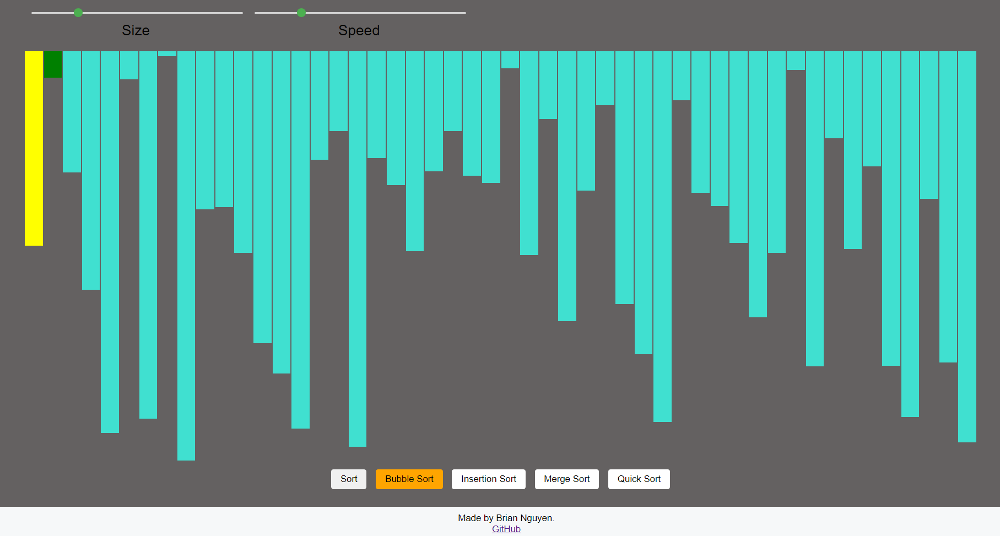

# Sorting Algorithms Visualiser - [**Try it out**](https://h1ddenleaf.github.io/sorting-algos-visualiser/)

### Features

- Built using React JS
- Implemented 4 different sorting algorithms: bubble sort, merge sort, quick sort and insertion sort.
- Highlighted sorting process using colours.
- Size of the array and speed of the sorting algorithm are adjustable.

### What it looks like

